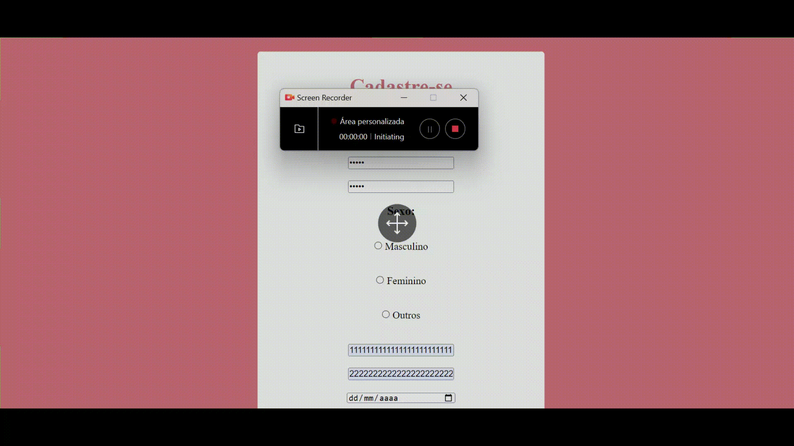

## 📃 Validação de Cadastro

Projeto realizado para desenvolver o aprendizado em validações de campos em um site.

## 📈 Índice 
* [Validação de Cadastro](https://github.com/Witoriabeatriz/Cadastro-versao-primaria/tree/main#-valida%C3%A7%C3%A3o-de-cadastro)  
* [Capa do projeto](https://github.com/Witoriabeatriz/Cadastro-versao-primaria/tree/main#%EF%B8%8F-capa-do-projeto)  
* [Descrição](https://github.com/Witoriabeatriz/Cadastro-versao-primaria/tree/main#-descri%C3%A7%C3%A3o)  
* [Introdução](https://github.com/Witoriabeatriz/Cadastro-versao-primaria/tree/main#-introdu%C3%A7%C3%A3o)  
* [Composição do projeto](https://github.com/Witoriabeatriz/Cadastro-versao-primaria/tree/main#%EF%B8%8F-composi%C3%A7%C3%A3o-do-projeto)  
* [Tecnologias utilizadas](https://github.com/Witoriabeatriz/Cadastro-versao-primaria/tree/main#-tecnologias-utilizadas)  
* [Ferramentas utilizadas](https://github.com/Witoriabeatriz/Cadastro-versao-primaria/tree/main#-ferramentas-utilizadas)  
* [Funcionalidades](https://github.com/Witoriabeatriz/Cadastro-versao-primaria/tree/main#-funcionalidade)
* [Instruções de uso](https://github.com/Witoriabeatriz/Cadastro-versao-primaria/tree/main#%EF%B8%8F-como-usar)

## 🖥️ Capa do projeto

## 📌 Descrição

* Foi desenvolvido no primeiro trimestre como a versão primária do projeto.

* **Observação:** Já temos a segunda versão deste projeto pronta. Você pode conferir a segunda versão [aqui](https://witoriabeatriz.github.io/Cadastro-versao-final/).

## 📝 Introdução

Este projeto concentra-se na verificação de campos preenchidos para cadastro de usuários com validação de entrada em JavaScript. O objetivo deste projeto é criar um formulário de cadastro com campos obrigatórios e realizar validações para garantir que os dados inseridos sejam válidos antes de enviar o formulário.

## 🛠️ Composição do projeto 

O projeto consiste em três arquivos principais:

* index.html: Este é o arquivo HTML que contém o formulário de cadastro.

* cadastro.js: Este arquivo JavaScript contém as funções de validação do formulário.

* cadastro.css: O arquivo CSS que estiliza o formulário.

## 🤖 Tecnologias Utilizadas
* html 5
* javascript
* css

## ⌨ Ferramentas utilizadas

Este projeto foi utilizado as seguintes ferramentas:
* git
* git hub
* visual Studio Code
* array

## 👾 Funcionalidade

* Validação de campos obrigatórios (todos os campos são obrigatórios).
* Verificação de senha: as senhas devem corresponder.
* Exibição de mensagens de erro caso os campos não sejam preenchidos corretamente.
- Exibição de mensagem de sucesso quando o cadastro é realizado com sucesso.

## 🖥️ Instruções de uso
1. Abra o arquivo `index.html` em um navegador da web.

2. Preencha o formulário de cadastro.

3. Clique no botão "ACESSAR" para enviar o formulário.

4. As mensagens de erro ou sucesso serão exibidas conforme apropriado.

## 🖌️Personalização
Você pode personalizar este projeto de acordo com suas necessidades, modificando o HTML, CSS e JavaScript conforme necessário.

## ✒ Autor
Este projeto foi criado por [Witória Beatriz Dos Santos](https://github.com/Witoriabeatriz)

 

